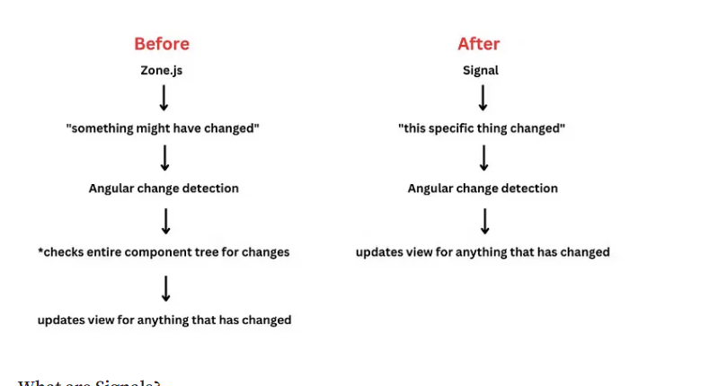

<h1 align="center">Angular version 16</h1>

- ## Signals (stable in v17)

- ## RxJS interoperability: the possibility to transform signal in observables
- ## Required inputs
- ## router data as component inputs
